# TaskLoop — Daily Task App

A mobile-friendly, installable **Progressive Web App (PWA)** for daily recurring tasks, backed by a **Node.js + Express** API and **MongoDB**.

> Your tasks are stored per-user in the cloud of your choice — locally on your PC, or on MongoDB Atlas. Sessions persist until you tap **Logout**.

---

## Architecture

<div align="center">



</div>

**Layers**
- **Clients** — Installable PWA (mobile home screen) and desktop browsers. The app shell works offline via a service worker; a session token, settings and an offline task cache live in `localStorage`.
- **Backend** — Node.js + Express. Serves the app and the REST API from one process (`:8000` web, `:4000` API). Handles JWT authentication (bcrypt hashed passwords), per-user task CRUD, the 24-hour auto-reset, and reminder scheduling.
- **Database** — MongoDB. `users` and `tasks` collections; every task is scoped to its owner via `userId`.

| Component | File | Responsibility |
|---|---|---|
| App UI & logic | `index.html` | Login/signup, rendering tasks, add/complete/delete, filters, reminders, sound presets |
| Session storage | `localStorage` | JWT token (`taskloop.token`), username (`taskloop.user`), settings, offline task cache |
| API + web server | `backend/server.js` | Express app, CORS, JSON, health check; auto-starts local MongoDB if it is not running; binds `0.0.0.0` for phone access; serves the app at `:8000` |
| Connect page | `/connect` (in `server.js`) | Generates a QR code with your PC's current address so your phone opens the app in one scan |
| Auth | `backend/routes/auth.js` + `backend/middleware/auth.js` | Username/password signup & login, bcrypt hashing, 365-day JWT (no automatic logout) |
| Task API | `backend/routes/tasks.js` | Per-user task create/read/update/delete + clear-completed |
| Database | MongoDB | `users` and `tasks` collections |
| Offline | `sw.js` | Serves the app shell offline; task data cached locally and re-synced |
| PWA metadata | `manifest.webmanifest` | Name, icons, standalone mode, installability |

---

## Features

- **User accounts** — username + password login, per-user task isolation in MongoDB.
- **Stay logged in** — sessions last until you tap **Logout** (no automatic logout).
- **24-hour auto-reset** — every completed task comes back as "new" after 24 hours, so your daily list always repeats.
- **Two daily reminders** — default 5:00 AM and 8:00 PM (configurable), with **customizable sound + volume** presets.
- **Works offline** — cached by a service worker; tasks are synced when the server is reachable.
- **Installable** — add to home screen on Android (Chrome) and iPhone (Safari).

---

## Data flow

### Login / session (persistent until logout)

```
App opens
  → token in localStorage?
      ├─ no  → show login screen
      └─ yes → GET /api/auth/me
               ├─ 200 → session restored, load tasks
               └─ 401 → show login screen (token revoked)

User logs in or signs up
  → POST /api/auth/login (or /signup)
  → { token, username }        (JWT valid 365 days)
      → stored in localStorage → stays logged in across restarts
      → removed only when the user taps "Logout"
```

### Task lifecycle (server-authoritative)

```
User adds task
  → POST /api/tasks { text }  → saved in MongoDB (owner = logged-in user)

User completes task
  → PUT /api/tasks/:id { done: true }  → doneAt = now
      → after 24 hours the app resets it: PUT { done: false }

Data is cached in localStorage for offline use; on reload the app
refetches from the API and overwrites the cache.
```

### Reminders

- **Android/Chrome** — Notification Triggers pre-schedule 60 days of 5 AM / 8 PM notifications (they work with the app closed).
- **While open** — a 30-second timer fires the chime + notification using the selected sound preset and volume.

---

## Project structure

```
taskapp/
├── index.html               # App UI + all app logic (login, tasks, reminders)
├── architecture.svg         # Animated architecture diagram (this README)
├── manifest.webmanifest     # PWA manifest (name, icons, standalone mode)
├── sw.js                    # Service worker (offline cache + push + notifications)
├── icon-192.png             # App icon 192×192
├── icon-512.png             # App icon 512×512 (also maskable)
├── apple-touch-icon.png     # iOS home-screen icon 180×180
├── README.md
└── backend/
    ├── server.js            # Express entry (web + API + auto-start MongoDB + /connect)
    ├── package.json
    ├── .env.example         # Config template (copy to .env)
    ├── start-taskloop.vbs   # Hidden launcher used for auto-start at login
    ├── models/
    │   ├── User.js          # User schema (username, password hash)
    │   └── Task.js          # Task schema (text, done, doneAt, owner)
    ├── routes/
    │   ├── auth.js          # signup / login / me endpoints
    │   └── tasks.js         # task CRUD endpoints
    ├── middleware/
    │   └── auth.js          # JWT verification
    └── .gitignore
```

---

## Getting started

### 1. Run the backend locally (recommended)

1. **MongoDB** runs as a Windows service. The backend also auto-starts it if it is stopped — you never need to open MongoDB Compass.
2. From `taskapp/backend/`:

   ```bash
   npm install
   npm start
   ```

   → Starts two listeners on `0.0.0.0`:
   - **`http://localhost:8000`** — the app (frontend + API on the same origin, so the phone needs no extra setup)
   - **`http://localhost:4000`** — the API only (backwards compatible)

   It connects to `mongodb://127.0.0.1:27017/taskloop` automatically.

3. (Optional) Make it start automatically when you log in:
   ```powershell
   # Already registered on this PC via the Run key:
   #   HKCU\Software\Microsoft\Windows\CurrentVersion\Run → "TaskLoop Backend"
   ```

### 2. Open the app on your phone

On your **PC**, open **`http://localhost:8000/connect`** — a QR code shows your PC's current address (it can change when Wi-Fi reconnects). Scan it with your phone's camera and the app opens with the Server address already filled in.

No address typing, no firewall digging. Log in and go.

### 3. Use MongoDB Atlas (optional — for access anywhere)

1. Create a free cluster at <https://www.mongodb.com/atlas>.
2. In `backend/`, copy `.env.example` to `.env` and set:

   ```
   MONGODB_URI=mongodb+srv://<user>:<pass>@<cluster>.mongodb.net/taskloop
   JWT_SECRET=<a-long-random-string>
   PORT=4000
   CLIENT_ORIGIN=https://nagurbabu135-glitch.github.io
   ```

3. Run `npm start`.

> Hosting the API on a free service like Render gives you a permanent HTTPS URL you can reach from anywhere.

---

## API reference

| Method | Endpoint | Auth | Description |
|---|---|---|---|
| POST | `/api/auth/signup` | no | Create account `{ username, password }` → `{ token, username }` (seeds 4 sample tasks) |
| POST | `/api/auth/login` | no | Log in → `{ token, username }` |
| GET | `/api/auth/me` | yes | Verify session → `{ username }` |
| GET | `/api/tasks` | yes | List current user's tasks |
| POST | `/api/tasks` | yes | Create task `{ text }` |
| PUT | `/api/tasks/:id` | yes | Update `{ text?, done?, doneAt? }` |
| DELETE | `/api/tasks/:id` | yes | Delete one task |
| DELETE | `/api/tasks/completed` | yes | Delete all completed tasks |

---

## Hosting the frontend (GitHub Pages)

Live at: **https://nagurbabu135-glitch.github.io/taskapp/**

This is a public HTTPS mirror of the app shell (great for previewing, but note browsers block `http://` API calls from an HTTPS page — for full use on your phone, open the app from your PC's connect page).

To update it after changes:

```bash
git add .
git commit -m "update"
git push
```

---

## Roadmap

- Host the API on a free server (Render) for access from anywhere.
- Web Push (ntfy.sh / Firebase) for closed-app reminders on iPhone.
- Per-task "repeat daily" toggle.
- Task priorities and due dates.
